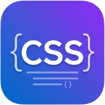
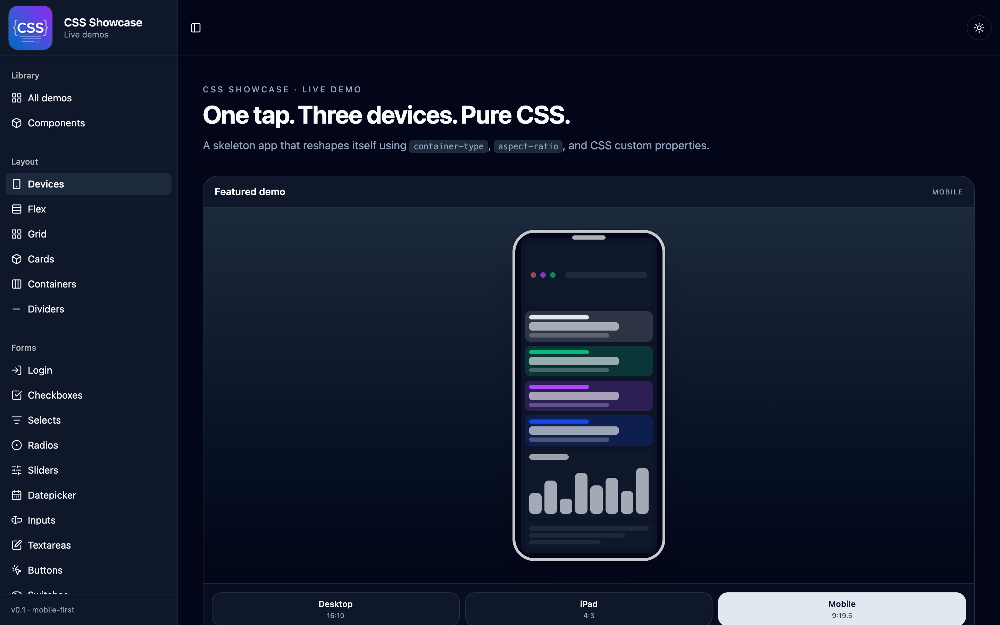

<div align="center">



# CSS Showcase

**Live CSS demos with the code for each example.**

[](https://github.com/ajbatac/css-showcase/stargazers)
[](https://github.com/ajbatac/css-showcase/forks)
[](https://github.com/ajbatac/css-showcase/issues)
[](https://github.com/ajbatac/css-showcase/commits/main)
[](https://github.com/ajbatac/css-showcase/actions/workflows/ci.yml)

[](https://www.typescriptlang.org/)
[](https://react.dev/)
[](https://tanstack.com/start)
[](https://tailwindcss.com/)
[](https://vite.dev/)
[](https://nitro.build/)



</div>

---

A collection of live CSS demos. Every page pairs a working example with the CSS that drives it, so you can watch a pattern behave and read the code behind it without leaving the page. Mobile-first, dark mode included.

## What's inside

- **37 demos** across seven categories: layout, forms, navigation, feedback, overlays, data display, and utilities
- **The device switcher** (home page): a skeleton app that reshapes itself between desktop, iPad, and mobile using container queries, `aspect-ratio`, and custom properties, with no JavaScript driving the layout
- **Code beside every demo**: the example first, the CSS for the selected pattern right below it
- **Light and dark themes** with a toggle, driven by CSS custom properties

## Quick start

```sh
git clone https://github.com/ajbatac/css-showcase.git
cd css-showcase
bun install        # or: npm install
bun run dev        # or: npm run dev
```

The dev server URL is printed in the terminal.

For a production build and a running server:

```sh
bun run build
bun run preview
```

The build lands in `.output`. The server listens on port 3000 by default; set `PORT` to change it.

## Scripts

| Command             | What it does                        |
| ------------------- | ----------------------------------- |
| `npm run dev`       | Start the dev server with HMR       |
| `npm run build`     | Production build into `.output`     |
| `npm run build:dev` | Development-mode build              |
| `npm run preview`   | Run the built server from `.output` |
| `npm run lint`      | ESLint over the repo                |
| `npm run format`    | Prettier over the repo              |

## Project layout

| Path                       | Contents                                                       |
| -------------------------- | -------------------------------------------------------------- |
| `src/routes/`              | One file per demo, mounted through TanStack file-based routing |
| `src/components/patterns/` | The demo implementations the routes render                     |
| `src/components/ui/`       | UI primitives built on Radix UI and Tailwind CSS               |
| `src/lib/demos.ts`         | The demo registry: slugs, icons, paths, categories             |
| `src/styles.css`           | Theme tokens for light and dark mode                           |

## Adding a demo

1. Register it in the `DEMOS` array in `src/lib/demos.ts` with a category, icon, and path.
2. Create a route file in `src/routes/`, for example `toggles.tsx`.
3. Build the demo in `src/components/patterns/` or inline in the route.
4. Run `bun run dev` and check it in the sidebar.

## Tech stack

TanStack Start with server-side rendering, TanStack Router, React 19, Tailwind CSS v4, Radix UI primitives, Vite, and Nitro for the server build. TypeScript throughout.

## Deploy

**Cloudflare Pages** (recommended): connect the repository in the Cloudflare dashboard with these settings:

- Production branch: `main`
- Build command: `npm run build`
- Build output directory: `dist`

The build detects Cloudflare's `CF_PAGES` environment and produces a Pages artifact (`_worker.js` plus static assets) in `dist`.

**Cloudflare Workers** as an alternative: `npm run deploy:cf` builds and deploys in one command after a one-time `npx wrangler login`.

Any other Node host works with the standard build: `npm run build` produces a server in `.output` that `npm run preview` runs.

## Contributing

Issues and pull requests are welcome. Run `npm run lint` before opening a pull request.

---

<div align="center">

**CSS Showcase** · live demos with the code · [ajbatac/css-showcase](https://github.com/ajbatac/css-showcase)

**Support our other projects:** [Launch Wizard](https://launch-wizard.techhive.net/) · by [Allan Batac](https://ajbatac.com)

[Terms](https://css.techhive.net/terms) · [Privacy](https://css.techhive.net/privacy) · [DMCA](https://css.techhive.net/dmca) · [Cookies](https://css.techhive.net/cookies) · [Disclaimer](https://css.techhive.net/disclaimer) · [UGC](https://css.techhive.net/ugc-disclaimer)

</div>
